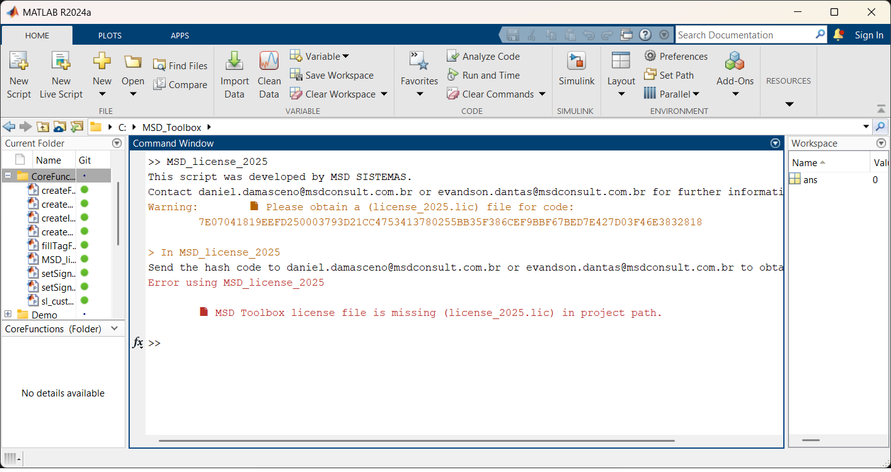

# MSD Simulink Toolbox

The **MSD Simulink Toolbox** provides a set of productivity functions designed to streamline modeling workflows in **MATLAB Simulink**.  
These tools automate common tasks such as creating Goto/From blocks, generating input/output interfaces, and assigning signal names intelligently — improving model clarity and consistency.

---

## ⚙️ Installation

Just run following command in MATLAB command window:

```matlab
mkdir C:\MSD_Toolbox
system('git clone https://github.com/MSD-Sistemas/MSD-Toolbox-Public C:\MSD_Toolbox')
addpath(genpath('C:\MSD_Toolbox'))
savepath
```


---

## 🚀 First Usage

After installation, you shall get a license.lic file from MSD SISTEMAS to enable the toolbox.
For that, just send us an email to daniel.damasceno@msdconsult.com.br with the HASH code generated in MATLAB command window by running:

```matlab
MSD_license_2025
```

You will get an information like this:


After receiving your license file, place it in the Toolbox root folder, typically located at:
```
C:\MSD_Toolbox
```

Now, you can start using the integrated into Simulink callbacks, model scripts, or custom context menus.

---

## 🧩 Available Functions

### 1. `setSignalNamesBasedOnSrcBlk(inArgs)`
Sets the signal name according to the **source block**:
- **From blocks:** Signal name = Tag  
- **Other blocks:** Signal name = Block name  

---

### 2. `setSignalNamesBasedOnDestBlk(inArgs)`
Sets the signal name according to the **destination block**:
- **Goto blocks:** Signal name = Tag  
- **Other blocks:** Signal name = Block name  

---

### 3. `fillTagFrom(inArgs)`
Automatically fills the **Tag** of a *From* block using the corresponding *Goto* block tag.

---

### 4. `createOutputBlocks(inArgs)`
Creates new **Output blocks** according to the selected element:
- For **Subsystems** → one Output per Outport (names inherited)  
- For **Bus Selectors** → one Output per selected signal  

---

### 5. `createInputBlocks(inArgs)`
Creates new **Input blocks** according to the selected element:
- For **Subsystems** → one Input per Inport  
- For **Outport blocks** → one From block per output signal  

---

### 6. `createGotoBlocks(inArgs)`
Generates **Goto blocks** based on selection:
- **Subsystem** → one Goto per Outport (Tag = Outport name)  
- **Inport block** → one Goto per Inport (Tag = Inport name)  
- **Bus Selector** → one Goto per selected signal  


---

### 7. `createFromBlocks(inArgs)`
Generates **From blocks** based on selection:
- **Subsystem** → one From per Inport (Tag = Inport name)  
- **Outport block** → one From per Outport (Tag = Outport name)  

---

## 🧠 Developer Notes

All functions delegate processing to corresponding internal implementations (e.g., `createFromBlocksFunction(inArgs)`), ensuring a clean separation between the Simulink interface and the logic layer.

Developed by **MSD SISTEMAS**  
📧 *daniel.damasceno@msdconsult.com.br*  
🧾 *Revision 1.0*

---

## 📁 Folder Structure

```
📦 MSD_SimulinkToolbox
 ┣ 📜 setSignalNamesBasedOnSrcBlk.m
 ┣ 📜 setSignalNamesBasedOnDestBlk.m
 ┣ 📜 fillTagFrom.m
 ┣ 📜 createOutputBlocks.m
 ┣ 📜 createInputBlocks.m
 ┣ 📜 createGotoBlocks.m
 ┣ 📜 createFromBlocks.m
 ┣ 📜 README.md
 ┣ 📜 CoreFunctions
      ┣ 📜 setSignalNamesBasedOnSrcBlkFunction.m
      ┣ 📜 setSignalNamesBasedOnDestBlkFunction.m
      ┣ 📜 fillTagFromFunction.m
      ┣ 📜 createOutputBlocksFunction.m
      ┣ 📜 createInputBlocksFunction.m
      ┣ 📜 createGotoBlocksFunction.m
      ┗ 📜 createFromBlocksFunction.m
 ┣ 📜 TestFunctions
      ┣ 📜 test_setSignalNamesBasedOnSrcBlk.m
      ┣ 📜 test_setSignalNamesBasedOnDestBlk.m
      ┣ 📜 test_fillTagFrom.m
      ┣ 📜 test_createOutputBlocks.m
      ┣ 📜 test_createInputBlocks.m
      ┣ 📜 test_createGotoBlocks.m
      ┗ 📜 test_createFromBlocks.m
 ┗ 📜 Demo
      ┗ 📜 createGoto.gif
```

---

## 🧩 Compatibility

- MATLAB R2020b or newer  
- Simulink required  

---

## 🪪 License

This toolbox is distributed under the [MSD License](LICENSE).  
A request of lincense is required for commercial use.